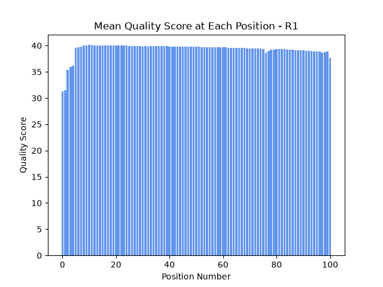
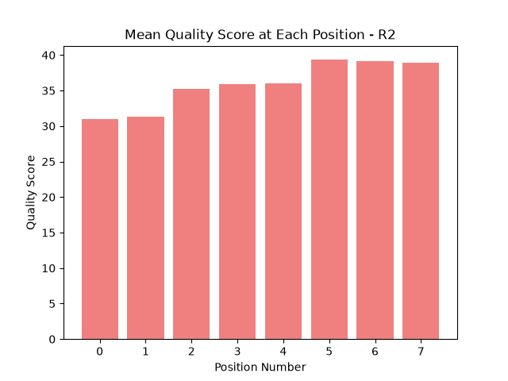
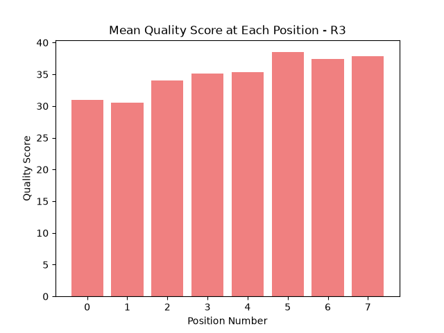
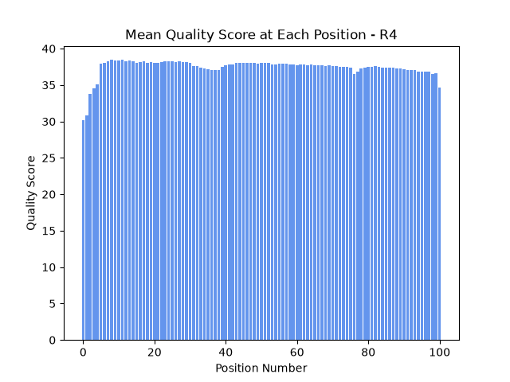

# Assignment the First

## Part 1
1. Be sure to upload your Python script. Provide a link to it here: 

    [barcodes](./barcodes_dist.py) 

    [biological reads](./bioreads_dist.py)

| File name | label | Read length | Phred encoding |
|---|---|---|---|
| 1294_S1_L008_R1_001.fastq.gz |read 1|101|phred-33|
| 1294_S1_L008_R2_001.fastq.gz |index 1|8|phred-33|
| 1294_S1_L008_R3_001.fastq.gz |index 2|8|phred-33|
| 1294_S1_L008_R4_001.fastq.gz |read 2|101|phred-33|

Phred encoding is phred-33 since N bases are encoded with the score # which equals 2 in phred-33 and is not present in phred-64

2. Per-base NT distribution
    1. Use markdown to insert your 4 histograms here.

    
    
    
    

    2. I am choosing Q20 as my cutoff, corresponding to a per-base error probability of 1%. Since the minimum distance between barcodes is 3bp, a single low quality base in an index can't actually cause a read to get assigned to the wrong sample because there's no valid barcode just 1 base away from another, so in this case the read would be sent to "unknown" instead of misassigning it. The barcode design already protects against that kind of error, so I didn't feel like I needed to go stricter with Q30. Q20 still filters out the genuinely bad base calls but keeps more of the data, which felt like the better tradeoff.

    3. 7304664 indexes have undetermined base calls

       `zcat 1294_S1_L008_R2_001.fastq.gz 1294_S1_L008_R3_001.fastq.gz | awk 'NR%4==2' | grep -c 'N'`
    
## Part 2
1. Define the problem
2. Describe output
3. Upload your [4 input FASTQ files](../TEST-input_FASTQ) and your [>=6 expected output FASTQ files](../TEST-output_FASTQ).
4. Pseudocode
5. High level functions. For each function, be sure to include:
    1. Description/doc string
    2. Function headers (name and parameters)
    3. Test examples for individual functions
    4. Return statement
